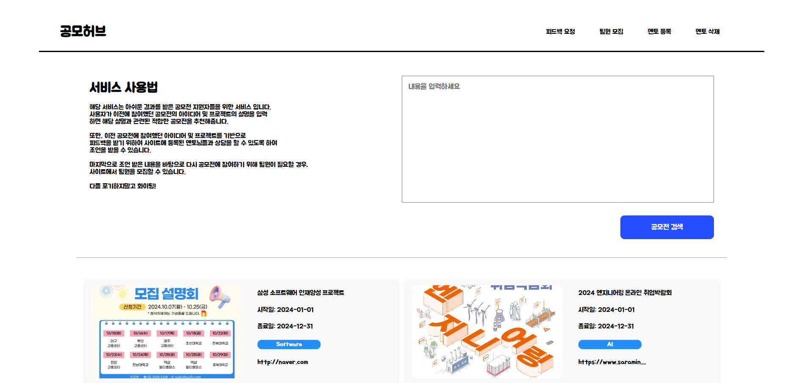
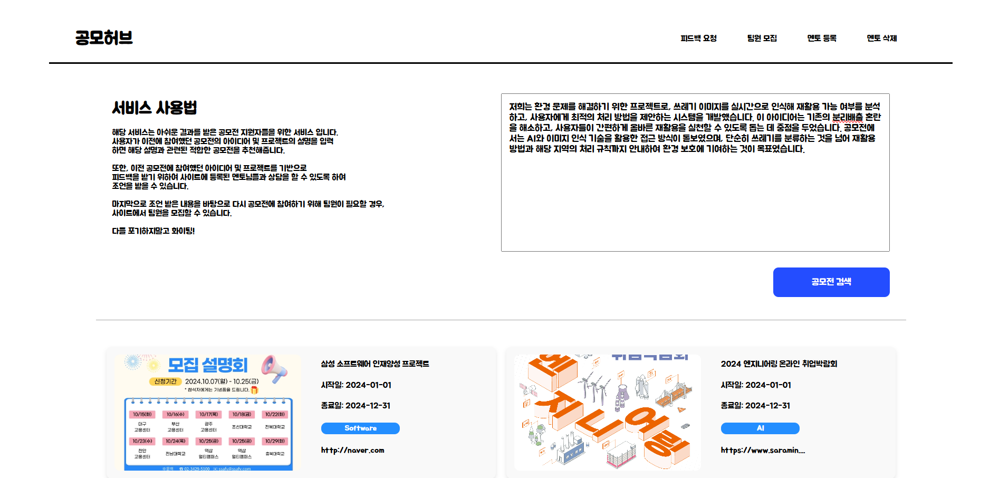

# TEAM - 한동근 으쌰으쌰 팀

## 📌 팀 구성

|  이름  |             [김보성](https://github.com/NangManBo)             |                  [이상현](https://github.com/idealHyun)                   |                [이창의](https://github.com/changuii)                 |                     [한동근](https://github.com/l0o0lv)                      |
| :----: | :------------------------------------------------------------: | :-----------------------------------------------------------------------: | :------------------------------------------------------------------: | :--------------------------------------------------------------------------: |
| 프로필 |  |             |        |                |
|  역할  |     메인 페이지 구현 멘토 페이지 구현 API 연결 작업      | 페이지 디자인 작업 팀원 모집 작성 및 조회 페이지 공모전 조회 페이지 | 자바 형태소 분석 개발 AWS, Docker 이용 배포 QueryDSL 쿼리 개발 | 멘토, 공모전, 모집글 개발 데이터베이스 설계 및 개발 API 개발 문서 작성 |

## 💻 사용 기술

|                                                                                                                                                                  BACK END                                                                                                                                                                   |                                                                                                                                                                                                    FRONT END                                                                                                                                                                                                     |
| :-----------------------------------------------------------------------------------------------------------------------------------------------------------------------------------------------------------------------------------------------------------------------------------------------------------------------------------------: | :--------------------------------------------------------------------------------------------------------------------------------------------------------------------------------------------------------------------------------------------------------------------------------------------------------------------------------------------------------------------------------------------------------------: |
|      |      |

## 📃 페이지 소개

<table>
  <tr>
    <td align="center">메인페이지</td>
    <td align="center">메인페이지(입력)</td>
  </tr>
  <tr>
    <td></td>
    <td></td>
  </tr>
  <tr>
    <td align="center">공모전 검색 결과 페이지</td>
    <td align="center">멘토에게 피드백 요청 페이지</td>
  </tr>
  <tr>
    <td></td>
    <td></td>
  </tr>
  <tr>
    <td align="center">멘토 등록 페이지</td>
    <td align="center">멘토 삭제 페이지</td>
  </tr>
  <tr>
   <td></td>
    <td></td>
   
  </tr>
  <tr>
    <td align="center">팀원 모집 게시글 작성 페이지</td>
    <td align="center">팀원 모집 페이지</td>
  </tr>
  <tr>
    <td></td>
    <td></td>
  </tr>
</table>
